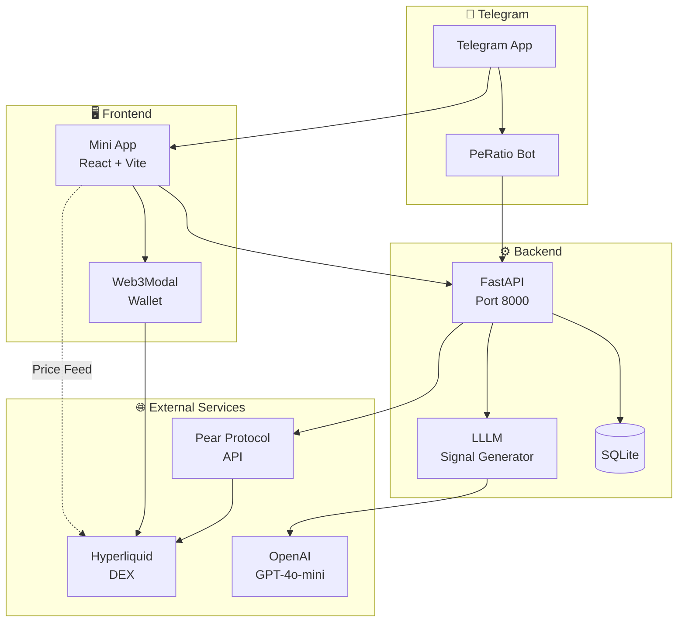
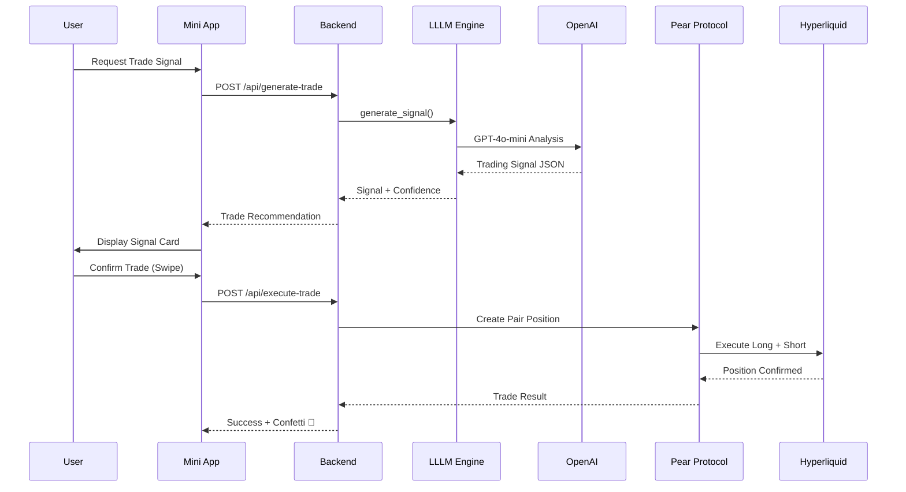
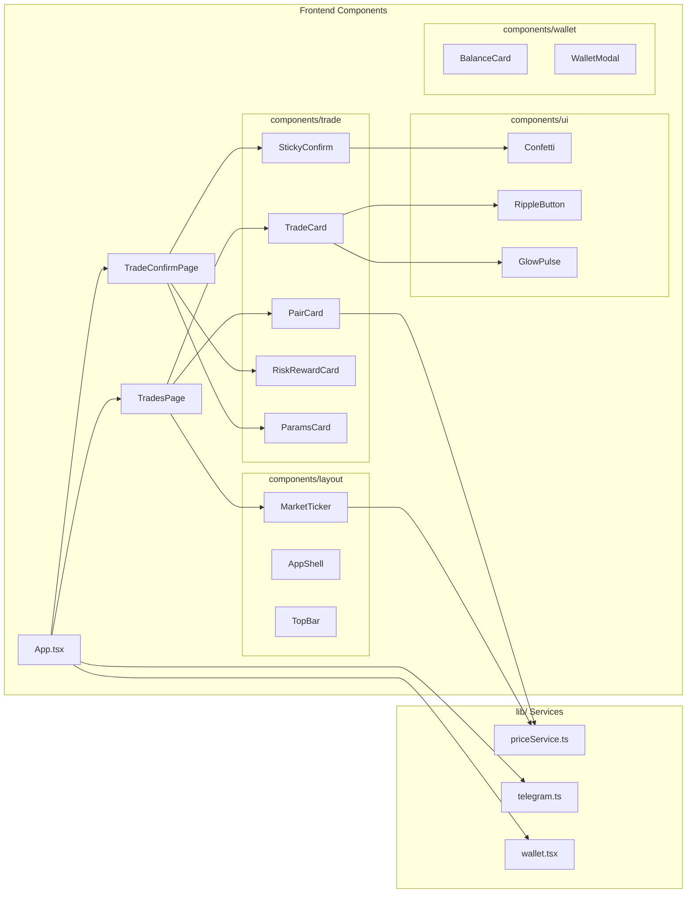
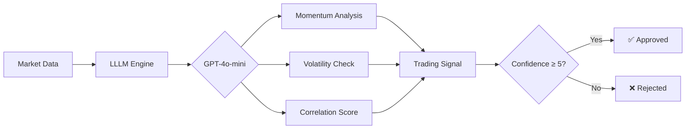
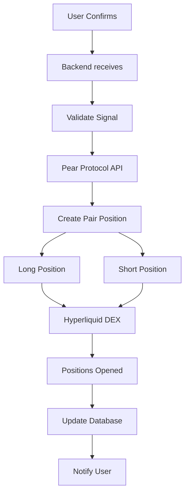

# PeRatio - AI-Powered Pair Trading Bot

<p align="center">
  
</p>

<p align="center">
  <strong>Telegram Mini App for automated crypto pair trading powered by AI and Pear Protocol</strong>
</p>

<p align="center">
  <a href="#features">Features</a> •
  <a href="#architecture">Architecture</a> •
  <a href="#quick-start">Quick Start</a> •
  <a href="#api-reference">API Reference</a> •
  <a href="#trading-flow">Trading Flow</a>
</p>

---

## 🎯 Overview

PeRatio is a Telegram Mini App that enables users to execute **pair trades** (simultaneous long/short positions) on crypto assets using AI-generated trading signals. The app leverages:

- **GPT-4o-mini** for intelligent market analysis and signal generation
- **Pear Protocol** for on-chain pair trade execution on Hyperliquid
- **Hyperliquid** for real-time price feeds and perpetual trading
- **Telegram Bot API** for seamless mobile-first user experience

## ✨ Features

| Feature | Description |
|---------|-------------|
| 🤖 **AI Trading Signals** | GPT-4o-mini analyzes market momentum, volatility, and correlations |
| 📊 **Real-time Prices** | Live price feeds from Hyperliquid API |
| ⚡ **One-tap Trading** | Swipe to confirm trades with visual feedback |
| 🔐 **Wallet Integration** | Web3Modal + WalletConnect for secure signing |
| 📱 **Telegram Native** | Full Mini App integration with native UI/UX |
| 🎨 **Visual Feedback** | Confetti animations, ripple effects, glow pulses |

## 🏗️ Architecture

### System Overview



### Trading Signal Flow



### Component Architecture



## 📁 Project Structure

```
TG_TRADE/
├── 📱 Frontend (React + Vite + TypeScript)
│   ├── src/
│   │   ├── App.tsx              # Main app router
│   │   ├── main.tsx             # React entry point
│   │   │
│   │   ├── components/
│   │   │   ├── ui/              # Reusable UI primitives
│   │   │   │   ├── AnimatedNumber.tsx
│   │   │   │   ├── Confetti.tsx
│   │   │   │   ├── GlowPulse.tsx
│   │   │   │   ├── Modal.tsx
│   │   │   │   ├── RippleButton.tsx
│   │   │   │   ├── SegmentedSwitch.tsx
│   │   │   │   ├── SettingsModal.tsx
│   │   │   │   ├── Shimmer.tsx
│   │   │   │   ├── Skeleton.tsx
│   │   │   │   └── Toast.tsx
│   │   │   │
│   │   │   ├── trade/           # Trade-related components
│   │   │   │   ├── CoinSelectModal.tsx
│   │   │   │   ├── PairCard.tsx
│   │   │   │   ├── ParamsCard.tsx
│   │   │   │   ├── PerformanceChart.tsx
│   │   │   │   ├── RiskRewardCard.tsx
│   │   │   │   ├── StickyConfirm.tsx
│   │   │   │   ├── TradeCard.tsx
│   │   │   │   └── TradeSignal.tsx
│   │   │   │
│   │   │   ├── layout/          # Layout components
│   │   │   │   ├── AppShell.tsx
│   │   │   │   ├── CryptoBackground.tsx
│   │   │   │   ├── MarketTicker.tsx
│   │   │   │   ├── SplashScreen.tsx
│   │   │   │   └── TopBar.tsx
│   │   │   │
│   │   │   └── wallet/          # Wallet components
│   │   │       ├── BalanceCard.tsx
│   │   │       ├── WalletIcons.tsx
│   │   │       └── WalletModal.tsx
│   │   │
│   │   ├── pages/
│   │   │   ├── TradesPage.tsx   # Portfolio view
│   │   │   └── TradeConfirmPage.tsx
│   │   │
│   │   └── lib/                 # Utilities & services
│   │       ├── priceService.ts  # Hyperliquid price API
│   │       ├── telegram.ts      # TG WebApp helpers
│   │       ├── wallet.tsx       # Web3 wallet context
│   │       └── mockData.ts      # Mock data for development
│   │
│   ├── public/                  # Static assets
│   ├── scripts/                 # Shell scripts
│   │   └── start.sh             # Start all services
│   ├── index.html
│   └── vite.config.ts
│
├── ⚙️ Backend (FastAPI + Python)
│   ├── backend/
│   │   ├── main.py              # FastAPI app
│   │   ├── config.py            # Environment settings
│   │   ├── database.py          # SQLite + SQLModel
│   │   ├── models.py            # Trade, Position models
│   │   ├── schemas.py           # Pydantic schemas
│   │   ├── pear_api.py          # Pear Protocol client
│   │   ├── requirements.txt     # Python dependencies
│   │   ├── .env                 # Backend config
│   │   │
│   │   ├── lllm/                # AI Signal Generator
│   │   │   ├── signal_generator.py  # Main signal logic
│   │   │   ├── llm_engine.py    # OpenAI integration
│   │   │   ├── basket_builder.py# Pair construction
│   │   │   ├── risk_manager.py  # Risk calculations
│   │   │   ├── pear_api_client.py
│   │   │   ├── data/            # Signal output files
│   │   │   │   └── *.json       # Generated signals
│   │   │   └── .env             # LLLM-specific config
│   │   │
│   │   └── pear-sdk/            # Pear Protocol TypeScript SDK
│   │       ├── src/
│   │       │   ├── place-order.ts
│   │       │   ├── trading-operations.ts
│   │       │   ├── config/
│   │       │   ├── examples/
│   │       │   └── utils/
│   │       └── package.json
│   │
├── 📚 Configuration
│   ├── package.json             # Frontend dependencies
│   ├── tailwind.config.js       # Tailwind CSS
│   ├── tsconfig.json            # TypeScript config
│   ├── postcss.config.js        # PostCSS config
│   └── .gitignore
│
└── 📖 Documentation
    └── README.md                # This file
```

## 🚀 Quick Start

### Prerequisites

- Node.js 18+
- Python 3.11+
- Telegram Bot Token
- OpenAI API Key
- Pear Protocol Access Token

### 1. Clone & Install

```bash
git clone https://github.com/kolyamkl/PeRatio.git
cd TG_TRADE

# Frontend
npm install

# Backend
cd backend
python -m venv .venv
source .venv/bin/activate
pip install -r requirements.txt
```

### 2. Configure Environment

```bash
# Backend (.env)
BOT_TOKEN=your_telegram_bot_token
BACKEND_URL=https://your-backend.loca.lt
MINI_APP_URL=https://your-frontend.ngrok-free.dev
OPENAI_API_KEY=sk-proj-...
PEAR_ACCESS_TOKEN=eyJhbGci...
PEAR_USER_WALLET=0x...
PEAR_AGENT_WALLET=0x...

# LLLM (backend/lllm/.env)
OPENAI_API_KEY=sk-proj-...
PEAR_API_URL=https://hl-v2.pearprotocol.io
PEAR_CLIENT_ID=HLHackathon9
```

### 3. Run Services

```bash
# Terminal 1: Backend
cd backend && uvicorn main:app --host 0.0.0.0 --port 8000

# Terminal 2: Frontend
npm run dev

# Terminal 3: Tunnel (for Telegram)
lt --port 8000 --subdomain your-backend

# Terminal 4: Generate Signal
cd backend/lllm && python signal_generator.py --live
```

### 4. Open in Telegram

1. Message `@peratio_bot` 
2. Click "Open App" button
3. Start trading!

## 📡 API Reference

### Trading Endpoints

| Method | Endpoint | Description |
|--------|----------|-------------|
| `POST` | `/api/generate-trade` | Generate AI trading signal |
| `POST` | `/api/execute-trade` | Execute pair trade on Pear |
| `GET` | `/api/trades` | List user's trades |
| `GET` | `/api/positions` | Get open positions |

### Generate Trade Signal

```http
POST /api/generate-trade
Content-Type: application/json

{
  "long_coin": "DOGE",
  "short_coin": "ARB",
  "bet_amount": 20,
  "leverage": 2,
  "user_id": 123456789
}
```

**Response:**
```json
{
  "signal": {
    "category": "MOMENTUM",
    "confidence": 8,
    "thesis": "DOGE shows positive momentum while ARB underperforms",
    "long": { "coin": "DOGE", "weight": 1.0 },
    "short": { "coin": "ARB", "weight": 1.0 },
    "stop_loss": 10,
    "take_profit": 20,
    "risk_reward_ratio": 2.0
  }
}
```

### Health Check

```http
GET /health

{
  "status": "ok",
  "bot_initialized": true,
  "openai_configured": true,
  "pear_configured": true
}
```

## 🔄 Trading Flow

### 1. Signal Generation



### 2. Trade Execution



### 3. Position Monitoring

- Real-time PnL tracking via Hyperliquid WebSocket
- Stop-loss and take-profit automation
- Telegram notifications for significant events

## 🛠️ Development

### Frontend Development

```bash
npm run dev        # Start dev server
npm run build      # Production build
npm run preview    # Preview build
```

### Backend Development

```bash
cd backend
uvicorn main:app --reload --port 8000
```

### LLLM Signal Generator

```bash
cd backend/lllm

# Generate single signal
python signal_generator.py --live

# Run as service
./start_lllm_service.sh
```

## 🔐 Security

- Never commit `.env` files
- API keys are server-side only
- Telegram initData validation
- Wallet signing for trades
- Rate limiting on all endpoints

## 📄 License

MIT License - see LICENSE file

## 🤝 Contributing

1. Fork the repository
2. Create feature branch (`git checkout -b feature/amazing`)
3. Commit changes (`git commit -m 'Add amazing feature'`)
4. Push to branch (`git push origin feature/amazing`)
5. Open Pull Request

---

<p align="center">
  Built with ❤️ for the Hyperliquid Hackathon 2026
</p>
